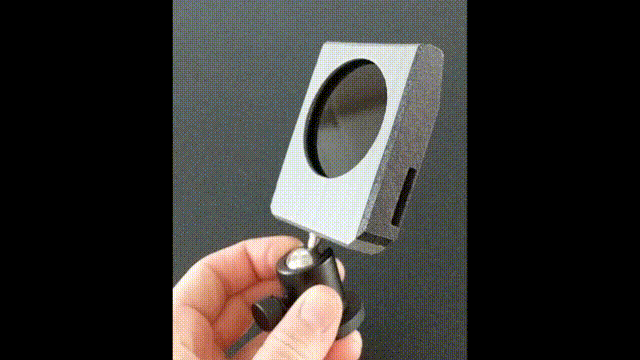

# RPI NOIR Camera with IR High Pass Filter

* https://www.raspberrypi.com/products/pi-noir-camera-v2/
* https://www.raspberrypi.com/products/raspberry-pi-zero-w/
* Use with Opteka 67mm IR filters, 720nm high pass
* Make the end cap out of TPU, so it's flexible and able to press fit
* Has a 1/4", 20 TPI nut in the bottom, so you can swap out whatever camera mount you want. I like this ball joint, mag type shown. 
  * https://www.amazon.com/ULIBERMAGNET-Magnetic-Mounting-Neodymium-Security/dp/B08BYG1FNK

## Assembly

## Example of LED Lamp with bandpass IR

