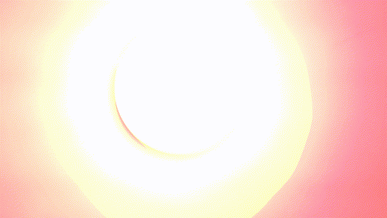

# RPI NOIR Camera with IR High Pass Filter

* https://www.raspberrypi.com/products/pi-noir-camera-v2/
* https://www.raspberrypi.com/products/raspberry-pi-zero-w/
* Use with Opteka 67mm IR filters, 720nm high pass

## Example of LED Lamp with bandpass IR

